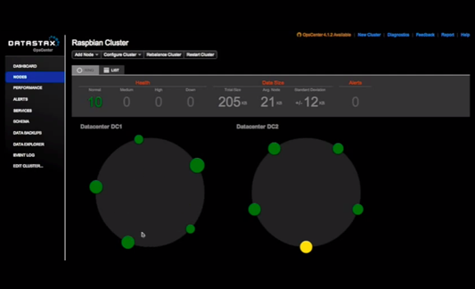

##  Test DataStax Enterprise Cluster 

*PP -> Marketing -> Details -> Description*

DataStax delivers Apache Cassandra in a database platform purpose built for the performance and availability demands of IOT, web, and mobile applications, giving enterprises a secure always-on database that remains operationally simple when scaled in a single datacenter or across multiple data centers and clouds.

DataStax Enterprise includes:

<ol>
<li>DataStax Enterprise Server</li>
<li>DataStax OpsCenter</li>
<li>Expert Support and Services</li>
</ol>

DataStax Enterprise transforms traditional businesses into Internet Enterprises with excellent functional capabilities and lower total cost of ownership over traditional relational databases.

Benefits of DataStax Enterprise:

<ul>
<li>Production-certified Cassandra with full software lifecycle management</li>
<li>Comprehensive enterprise security</li>
<li>Automatic management services for transparent maintenance operations</li>
<li>Built-in enterprise search capabilities on Cassandra data</li>
<li>Integrated streaming, real-time, batch analytics, and Hadoop integration</li>
<li>Workload management for transactional, analytic, and search operations</li>
<li>In-memory option for lightning-fast transactional and analytics workloads</li>
<li>Visual management and monitoring from any device</li>
<li>Around-the-clock expert support and services</li>
</ul>

### Useful Links

<a href="http://www.datastax.com/customers">Datastax Customers</a> 
<a href="http://www.datastax.com/dbas-guide-to-nosql">DBA’s Guide to NoSQL</a> 
<a href="http://www.datastax.com/wp-content/uploads/2013/10/DS_DataStax_DevCenter.pdf">Datastax OpsCenter Datasheet</a> 
<a href="http://cassandra.apache.org/">Apache Cassandra</a> 
<a href="http://www.datastax.com/resources/whitepapers/evaluating-apache-cassandra">Evaluating Apache Cassandra as a Cloud Database</a> 

